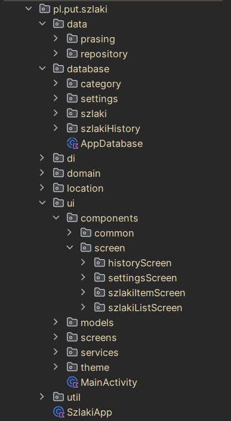

## Wędrownik - Jakub Wieczorek 151888 [Repozytorium](https://github.com/Kzazagzo/Wedrownik/tree/d13692aab4c433ad55f15bdd85da6d6a8c59a97f)
#### Aplikacja typu lista-szczegóły z animacją i elementami biblioteki-wsparcia

|                |                |                |
| -------------- | -------------- | -------------- |
|  |  |  |

      

### Streszczenie
Wędrownik jest prostą aplikacją do przeglądania szlaków w formatach GPX oraz XML, mającą wspierać użytkownika w jego hobbistycznych podróżach.

Aplikacja pozwala na:
* przeglądanie szlaków z widokiem na punkty,
* odznaczanie odwiedzonych punktów,
* kategoryzowanie szlaków według własnych potrzeb,
* wgląd na szlak na interaktywnej mapie,
* uruchamianie czasomierza do mierzenia czasu przejścia przez szlak (dla wielu szlaków jednocześnie, nawet przy wyłączonej aplikacji),
* podgląd przewyższeń trasy na animowanym wykresie,
* możliwość obliczenia przybliżonego czasu przybycia do następnego punktu,
* przeglądanie historii przebytych szlaków wraz ze stanem ich przejścia,
* pobieranie lokalizacji geograficznej do pokazania aktualnej pozycji na mapie (z niewiadomych przyczyn, nawet przy wyłączonej aplikacji),
*możliwość zatwierdzenia punktu jako odwiedzonego po podejściu do niego wystarczająco blisko*.
> (gdzie "możliwość" to dużo powiedziane, bo z faktycznych 10 prób podejścia pod taki punkt tylko 1 zakończyła się sukcesem [to znaczy, że aplikacja załapała podejście pod punkt - a nie że osoba testująca nie doszła do punktu], dlatego ten punkt i wszystkie związane z użyciem GPS nie będą opisywane szczegółowo i nie są załączone w tym inkremencie).

### Spis treści
1. Specyfikacje aplikacji i wymagania dotyczące uruchomienia
2. Zależności zewnętrzne i użyte biblioteki
3. Zastosowane rozwiązania w kodzie
4. Znane błędy występujące w aplikacji
5. Struktura plików w projekcie

> Większość funkcjonalności w tym sprawozdaniu posiada odnośnik w klamrach {01:11} do poszczególnego momentu w filmie, w którym pokazywana jest dana funkcjonalność, w hiperłączach przekazany jest link do miejsca w kodzie repozytorium. 

### 1. Specyfikacje aplikacji i wymagania dotyczące uruchomienia
Do poprawnego uruchomienia aplikacji na urządzeniu mobilnym wymagana jest co najmniej wersja API 30 (Android 11), wcześniejsze wersje nie są wspierane. Do kompilacji programu wystarczy najnowsza wersja Kotlina, Java 17 i AGP - które samodzielnie pobiorą pozostałe pakiety i zbudują cały projekt, lub działające IDE takie jak Android Studio.

### 2. Zależności zewnętrzne i użyte biblioteki
* Aplikacja napisana w Kotlinie
* Używa Jetpack Compose jako frameworku UI
* Hilt + Dagger - umożliwiają Dependency Injection (DI) i wprowadzają wsparcie dla architektury MVVM
* Room - zarządza bazą danych w ORM
* Voyager - lepsze zarządzanie nawigacją i przechowywaniem stanu aplikacji
* OsmDroid - interaktywne mapy (napisane w Javie, bez wsparcia i z ograniczoną kompatybilnością wsteczną)
* Vico - przedstawienie interaktywnych wykresów

### 3. Zastosowane rozwiązania w kodzie

#### 3.1 Ekrany i aktywności występujące w aplikacji
Aplikacja składa się z kilku aktywności, w tym mniejszych, widocznych tylko przez sekundy, jak początkowy ekran ładowania "[LoadingScreen](https://github.com/Kzazagzo/Wedrownik/blob/d13692aab4c433ad55f15bdd85da6d6a8c59a97f/app/src/main/java/pl/put/szlaki/ui/screens/LoadingScreen.kt#L37)", który swoją animacją ukrywa proces wczytywania danych z bazy danych na telefonie. Pozostałe aktywności odnoszą się do poszczególnych tabów widocznych na dolnym pasku nawigacji.

Wszystkie poniższe ekrany i pozostałe mniejsze funkcjonalności napisane są w tzw. clean architecture, gdzie większość elementów przekazana jest jako zależności innych elementów, co pozwala na sprawne testowanie. Wczytywanie wszystkich wymaganych danych przez warstwę widoku odbywa się poprzez zapytania do warstwy viewModel. Dzięki temu oczekiwanie na załadowanie się danych jest umilane ekranem ładowania, a w razie wystąpienia błędu po stronie warstwy danych, informacja o błędzie jest wyświetlana zamiast wyłączenia całej aplikacji [przykład użycia w kodzie](https://github.com/Kzazagzo/Wedrownik/blob/main/app/src/main/java/pl/put/szlaki/ui/components/screen/szlakiListScreen/CategoryTabFactory.kt#L224-L227).  
* [SzlakListScreen](https://github.com/Kzazagzo/Wedrownik/blob/main/app/src/main/java/pl/put/szlaki/ui/screens/SzlakiListScreen.kt) - przedstawiający bibliotekę szlaków (jedna z wymaganych aktywności)
* [SettingsScreen](https://github.com/Kzazagzo/Wedrownik/blob/main/app/src/main/java/pl/put/szlaki/ui/screens/SettingsScreen.kt) - ekran ustawień
* [HistoryScreen](https://github.com/Kzazagzo/Wedrownik/blob/main/app/src/main/java/pl/put/szlaki/ui/screens/HistoryScreen.kt) - ekran przechowujący historię przejścia przez szlaki
* [SzlakItemScreen](https://github.com/Kzazagzo/Wedrownik/blob/main/app/src/main/java/pl/put/szlaki/ui/screens/SzlakItemScreen.kt) - ekran przeglądania pojedynczego szlaku. (druga z wymaganych aktywności)
* [MainSingleScreen](https://github.com/Kzazagzo/Wedrownik/blob/main/app/src/main/java/pl/put/szlaki/ui/screens/MainSingleScreen.kt) - główny ekran (signle page application, zarządzająca ładowaniem innych ekranów)

#### 3.1 Aktywności główne - przeglądarka szlaków {0:00 - 0:36}
Wcześniej wspomniany SzlakListScreen ([Wersja na telefony (png)](https://github.com/Kzazagzo/Wedrownik/blob/main/image.png)), ([wersja na tablety (png)](https://github.com/Kzazagzo/Wedrownik/blob/main/image-3.png)) wyświetla posiadane przez użytkownika szlaki w lokalnej bazie danych. W ramach pojedynczego szlaku wyświetlana jest nazwa szlaku, stan przejścia szlaku w aktualnym podejściu (przedstawione przez [pasek postępu](https://github.com/Kzazagzo/Wedrownik/blob/d13692aab4c433ad55f15bdd85da6d6a8c59a97f/app/src/main/java/pl/put/szlaki/ui/components/screen/historyScreen/SzlakHistoryFragment.kt#L28)), liczbę punktów, z którego składa się szlak, oraz bliżej określony czas potrzebny na przejście szlaku w wybranym trybie prędkościowym. Każdy ze szlaków posiada także podgląd na mapie nawigacji - przedstawiający przybliżony przebieg trasy. Każdy [odcinek trasy](https://github.com/Kzazagzo/Wedrownik/blob/d13692aab4c433ad55f15bdd85da6d6a8c59a97f/app/src/main/java/pl/put/szlaki/ui/components/screen/szlakiListScreen/OsmMapPreViewFragment.kt#L22) wyznaczony jest pomiędzy punktami - czarny kolor odcinka oznacza, że szlak w tym miejscu został przetarty, czerwony natomiast nie.

 Przeglądarka szlaków zawiera również ekran historii z informacją o wszystkich szlakach (przekazanych do historii przez odpowiednią akcję) {1:20}. Szlaki w historii posiadają informacje o czasie przejścia przez szlak, pobranym ze stopera, ustawionym poziomie prędkości oraz stanie (procentowym) przejścia, z przekazaniem informacji, czy szlak został ukończony, czy nie.

Ekran ustawień zawiera informacje o kategoriach {1:36}, do których należą szlaki.
#### 3.2 Aktywności główne - przeglądarka pojedynczego szlaku {0:36 - 1:20}

W ramach pojedynczego szlaku użytkownik może przejrzeć trasę całego szlaku na dużej interaktywnej [mapie](https://github.com/Kzazagzo/Wedrownik/blob/d13692aab4c433ad55f15bdd85da6d6a8c59a97f/app/src/main/java/pl/put/szlaki/ui/components/screen/szlakiItemScreen/OsmMapViewFragment.kt#L26), gdzie, podobnie jak w mniejszym podglądzie, przejście szlaku jest na bieżąco aktualizowane. Możliwe jest także [udostępnienie lokalizacji](https://github.com/Kzazagzo/Wedrownik/blob/d13692aab4c433ad55f15bdd85da6d6a8c59a97f/app/src/main/java/pl/put/szlaki/location/DefaultLocationClient.kt#L16) do wskazania [aktualnej pozycji](https://github.com/Kzazagzo/Wedrownik/blob/d13692aab4c433ad55f15bdd85da6d6a8c59a97f/app/src/main/java/pl/put/szlaki/ui/components/screen/szlakiItemScreen/OsmMapViewFragment.kt#L133-L153) użytkownika na mapie świata. W przeglądarce szlaku użytkownik ma do wyboru prędkość przejścia przez szlak od wolnego do szybkiego.

[Stoper szlaku](https://github.com/Kzazagzo/Wedrownik/blob/d13692aab4c433ad55f15bdd85da6d6a8c59a97f/app/src/main/java/pl/put/szlaki/ui/services/SzlakNotificationService.kt#L31) pozwala na mierzenie czasu podróży przez szlak. Mierzenie czasu odbywa się za pomocą mikroserwisu, co oznacza, że jest niezależne od stanu aplikacji - może być ona wyłączona, a nawet zakończona, co nie wpłynie na działanie stopera szlaku. Ponowne uruchomienie aplikacji i konkretnego widoku szlaku automatycznie zsynchronizuje stan szlaku z serwisem. Dodatkowo możliwe jest jednoczesne uruchomienie kilku podróży, gdzie każdy stoper działa niezależnie od innych i samego stanu aplikacji. Głównym zastosowaniem mikroserwisu jest jednak pobieranie aktualnej pozycji użytkownika i aktualizowanie przejścia szlaku po zbliżeniu się do punktu (funkcjonalność nie działa jak należy - brak w inkremencie).

Jeżeli szlak zawiera informacje o wysokościach punktów, widoczny jest [wykres zmiany przewyższenia](https://github.com/Kzazagzo/Wedrownik/blob/d13692aab4c433ad55f15bdd85da6d6a8c59a97f/app/src/main/java/pl/put/szlaki/ui/components/screen/szlakiItemScreen/ChartSzlakFragment.kt#L45) wraz z dalszym przejściem przez szlak. Punkt startowy wyznacza wysokość punktu początkowego, według której określane są dalsze zmiany wysokości. Cały wykres jest w pełni interaktywny i animowany, co pozwala na zbadanie konkretnego punktu na trasie.

Przejście przez szlak odbywa się przez odznaczanie punktów jako odwiedzonych. Każdy z punktów posiada informację o odległości od poprzedniego punktu, przewidywanym czasie przejścia do następnego punktu w zależności od wybranego trybu podróży oraz przybliżonym kierunku od poprzedniego punktu.

#### 3.2 Fragmenty
Co prawda sam framework Compose nie wspiera fragmentów, możemy przyjąć, że każdy "kompozyt" - najmniejszy element wyświetlany, jest ów kompozytem. Poza tym, elementy takie jak mapy (które są napisane w Javie, a nie w Kotlinie), korzystają z [nakładki fragmentów](https://github.com/Kzazagzo/Wedrownik/blob/d13692aab4c433ad55f15bdd85da6d6a8c59a97f/app/src/main/java/pl/put/szlaki/ui/components/screen/szlakiItemScreen/OsmMapViewFragment.kt#L15) do prawidłowego wyświetlania, gdyż Jetpack Compose nie wspiera ich prawidłowego wyświetlania i odświeżania.

#### 3.3 Wersja aplikacji na telefony i tablety {3:09 - wersja tabletowa}
Korzystając z faktu, że interfejs jest utworzony w podejściu deklaratywnym za pomocą Jetpack Compose, interfejs samoistnie dostosowuje się do rodzaju urządzenia. Na większych ekranach przeglądarka szlaków wyświetla się w siatce (np. dla szlaków są to 3 elementy w rzędzie), a każdy pozostały element wypełnia się do szerokości lub wysokości ekranu.

#### 3.4 Baza danych
Do przechowywania szlaków, kategorii, historii i ustawień aplikacja korzysta z bazy danych z funkcjonalnością ORM (Object-Relation Mapping), co upraszcza korzystanie z bazy danych poprzez brak konieczności zapytań SQL o konkretne obiekty – zamiast tego można bezpośrednio przekazywać je do bazy.
Jednakże nie zawsze to działa poprawnie i dla bezpieczeństwa [zapytania](https://github.com/Kzazagzo/Wedrownik/blob/d13692aab4c433ad55f15bdd85da6d6a8c59a97f/app/src/main/java/pl/put/szlaki/database/szlaki/SzlakiTurystyczneDao.kt#L14) są tam zapisane

>W ramach tabeli szlaków i historii dostępne są następujące operacje:
Z poziomu interfejsu wszystkie szlaki podlegają operacjom CRUD:
 * C (Create) - tworzenie przez [przycisk FAB](https://github.com/Kzazagzo/Wedrownik/blob/d13692aab4c433ad55f15bdd85da6d6a8c59a97f/app/src/main/java/pl/put/szlaki/ui/components/screen/szlakiListScreen/AddSzlakFab.kt#L33) z ikoną w prawym dolnym rogu ekranu. Wszystkie szlaki [wczytywane są](https://github.com/Kzazagzo/Wedrownik/blob/d13692aab4c433ad55f15bdd85da6d6a8c59a97f/app/src/main/java/pl/put/szlaki/ui/components/screen/szlakiListScreen/AddSzlakFab.kt#L57) w formacie GPX (formacie udostępnianym przez wszystkie dobre aplikacje udostępniające szlaki) lub XML o specjalnej strukturze – błędny format zwróci błąd wczytania szlaku. W przypadku kolizji nazw lub braku nazwy w wczytanym szlaku, pojawi się okno dialogowe z prośbą o podanie nazwy szlaku.
 * R (Read) - wyświetlanie szlaków, a także filtrowanie ich przez umieszczony pasek wyszukiwania u góry ekranu.
 * U (Update) - aktualizacja stanu przejścia szlaku lub zakończenie podróży – przez przekazanie czasu przejścia szlaku do historii.
 * D (Delete) - usunięcie szlaku (pojedyncze lub grupowe). {1:23}

 > W ramach kategorii, do których należy szlak:
 * C (Create) - każda kategoria jest wyznaczana przez użytkownika i tworzona przez oddzielny przycisk FAB, co oznacza, że nie ma ścisłego podziału na szlaki krótkie, średnie i długie. Użytkownik sam może przypisać szlaki do własnych upodobań, np. na takie do przejścia, ulubione czy dostosowane do swoich potrzeb.
 * R (Read) - kategorie są widoczne wraz ze szlakami. Domyślnie żadna kategoria nie jest utworzona, a wszystkie elementy należą do domyślnej kategorii, która zostaje usunięta, jeśli żaden szlak do niej nie należy. Nowo utworzone szlaki są też domyślnie do niej dodawane.
 * U (Update) - każdy szlak może należeć jednocześnie do wielu kategorii (jeśli np. chcielibyśmy mieć jednocześnie szlak w kategorii ulubionych i np. kategorii szlaków długich). Pozycja i nazwa kategorii mogą być zmieniane w ekranie ustawień. {1:35}
 * D (Delete) - kategoria może być usunięta, a należące do niej szlaki, które nie należą do żadnej innej kategorii, trafią do kategorii domyślnej.

 #### 3.5 Odmierzanie czasu przez stoper
[Stoper szlaku](https://github.com/Kzazagzo/Wedrownik/blob/d13692aab4c433ad55f15bdd85da6d6a8c59a97f/app/src/main/java/pl/put/szlaki/ui/services/SzlakNotificationService.kt#L100) wspiera operacje rozpoczęcia odliczania, jeśli dla aktualnego szlaku stoper nie jest włączony, albo przerwanie odmierzania czasu, jeśli stoper jest aktualnie włączony. Reset stopera może zostać wykonany wyłącznie przez zakończenie podróży na szlaku. Stan stopera jest zawsze widoczny przez [powiadomienie](https://github.com/Kzazagzo/Wedrownik/blob/d13692aab4c433ad55f15bdd85da6d6a8c59a97f/app/src/main/java/pl/put/szlaki/ui/services/SzlakNotificationService.kt#L153) na pasku powiadomień, którego kliknięcie przeniesie do widoku mierzonego szlaku, a także zatrzymanie stopera przez ukryty przycisk wykonaj akcję w widoku szlaku. Każda sekunda odliczona przez stoper jest automatycznie aktualizowana w bazie danych, przez wykorzystanie wcześniej wspomnianego ORM w bazie - operacja jest bardzo szybka (dla ponad 20 włączonych stoperów, wszystkie operacje działały bez zarzutów, nawet przy wyłączonej aplikacji).

Przy nagłym zatrzymaniu mikroserwisu, z którego uruchomiony jest stoper (np. przy odebraniu dostępu do lokalizacji, włączonym trybie nawigacji lub zatrzymaniu stopera przez system operacyjny w przypadku niskiego poziomu baterii), stoper może zostać włączony ponownie od ostatniego zapisanego odczytu w bazie danych.

 #### 3.6 Motyw
Jetpack Compose deklaratywnie wykorzystuje motyw telefonu użytkownika do dostosowania widoku aplikacji. Jeżeli włączony jest tryb ciemny (ekran telefonu), wszystkie barwy przybiorą odcienie przyjemne dla oczu w trybie ciemnym i vice versa w trybie jasnym (widok tabletu jako przykład).

Wspierane są również tryby kolorów daltonistycznych i kontrastowych, z różnymi poziomami. Dlatego też na różnych urządzeniach aplikacja może wyglądać inaczej.

Wszystkie ikony (poza logo aplikacji) oraz czcionki pochodzą z biblioteki wzornictwa.
#### 3.7 Stany, zmienne 
Korzystanie z Jetpack Compose i odpowiednich technik do zapamiętywania i przechowywania wartości zmiennych (np. w bazie danych) uodparnia cały interfejs przed utratą danych w wyniku obrotu ekranu czy nawet wyjścia z aplikacji. W tej funkcjonalności posunięto się o krok dalej - aplikacja posiada zoptymalizowany sposób na przejście w tryb uśpienia. Zarządza tym biblioteka do nawigacji, która serializuje wszystkie dane, co znacząco zmniejsza zapotrzebowanie aplikacji na pamięć w trybie zminimalizowanym, i pozwala na jej wybudzenie, gdy jest potrzebna, z zachowaniem stanu wszystkich zmiennych, nawet po bardzo długim okresie.

#### 3.8 Nawigacja 
Nawigacja odbywa się przez [dolny pasek nawigacji](https://github.com/Kzazagzo/Wedrownik/blob/d13692aab4c433ad55f15bdd85da6d6a8c59a97f/app/src/main/java/pl/put/szlaki/ui/screens/MainSingleScreen.kt#L105), za pomocą którego można przejść do ekranu szlaków, ustawień i historii. Aplikacja w pełni i poprawnie zarządza stanem aktualnej karty, dzięki czemu można nawigować i wychodzić z kart, używając systemowego przycisku cofnięcia akcji.

#### 4 Znane błędy występujące w aplikacji

Przy kalkulacji zakończenia w historii wykorzystywane jest porównanie na typach double, aby sprawdzić, czy długość trasy jest równa długości przejścia. Istnieje jednak prawdopodobieństwo, że np. ostatni punkt szlaku (o odległości np. 3 metry od poprzedniego) nie zostanie zaznaczony jako wykonany. Pasek postępu, który zaokrągla wartości do 10 metrów, może błędnie wskazywać na wartość zakończenia szlaku.

Niektóre portale udostępniające dane o szlakach zamiast pozostawić wartości wysokości puste, zapełniają je zerami. W związku z tym aplikacja nie jest pewna, czy trasa szlaku jest w całości po płaskim terenie, czy też dane te zostały omyłkowo wprowadzone. Dla poprawności przyjmowane jest pierwsze podejście, czyli traktowanie tych wartości jako trasy po płaskim terenie.

#### 5 Struktura plików

Jeżeli, któryś z opisanych elementów wymaga dodatkowego sprawdzenia z kodem, cały projekt jest zgodny z oficjalną dokumentacją androida na temat nazewnictwa pakietów, co za tym idzie:

|                |                |
| -------------- | -------------- |
|  | 
<ul><li><b>Data</b> - zawiera klasy odpowiadające za prawidłową transformację danych<ul><li><b>Parsing</b> - operacje wczytujące pliki</li><li><b>Repository</b> - operacje odczytujące dane z bazy danych</li></ul></li></ul><ul><li><b>Database</b> - Klasy (tabele) przechowywanych obiektów oraz dostępne operacje<ul><li>Każdy pakiet odpowiada oddzielnej tabeli</li><li>AppDatabase odpowiada za dostarczenie bazy danych</li></ul></li><li><b>di</b> - Wszystkie klasy i obiekty, które są wstrzykiwane przez dependency injection</li><li><b>domain</b> - Klasy i operacje wykonywane przez obiekty w OOP</li><li><b>location</b> - Klasy i interfejsy odpowiedzialne za pobieranie lokalizacji użytkownika</li><li><b>ui</b> - Klasy i kompozyty przedstawiające warstwę aplikacji<ul><li><b>components</b> - funkcje kompozytowe, używane kilkukrotnie przez:<ul><li>common - wiele ekranów</li><li>screens - poszczególne ekrany<ul><li>o nazwie pakietu</li></ul></li></ul></li><li><b>models</b> - Klasy ViewModels zarządzające stanem aplikacji w architekturze MVVM</li><li><b>screens</b> - Klasy głównych ekranów aplikacji</li><li><b>service</b> - mikroserwisy (zarządzanie powiadomieniami)</li><li><b>theme</b> - dynamiczna generacja kolorów</li></ul></li><li><b>util</b> - funkcje i operacje pomocnicze</li></ul>
 |

