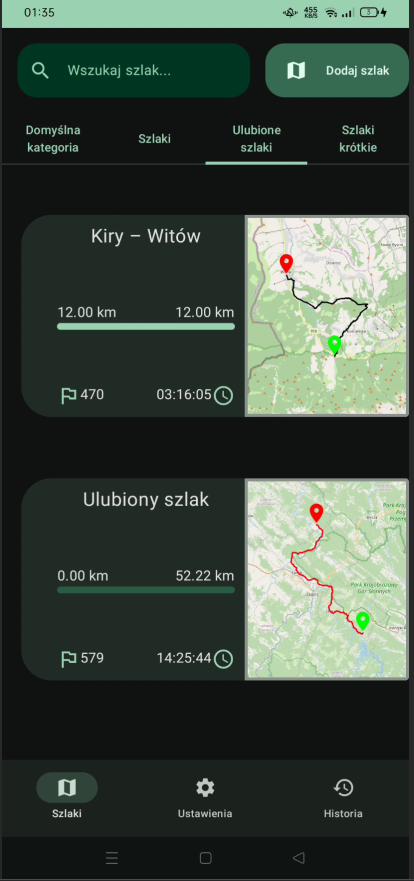
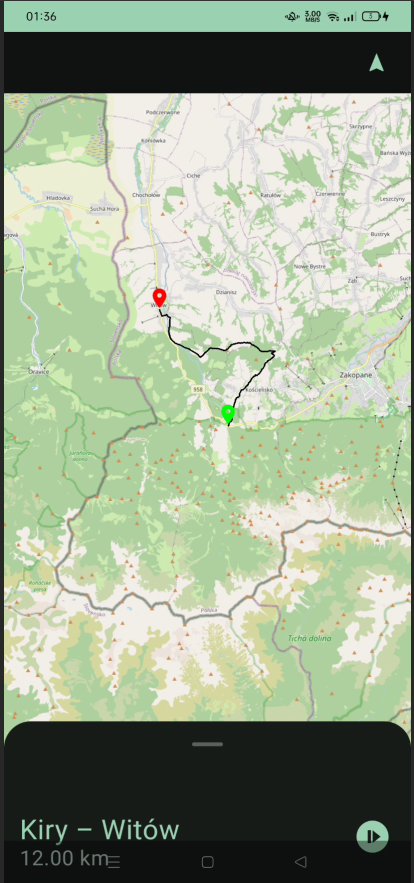
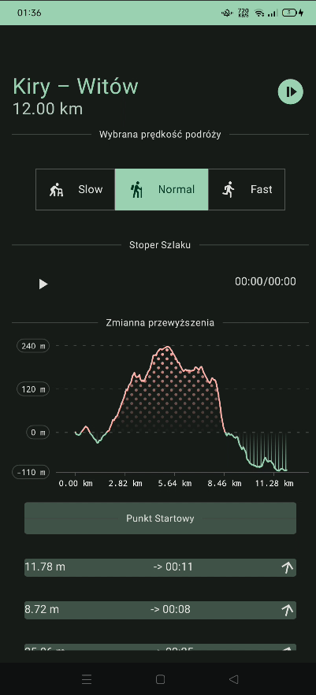
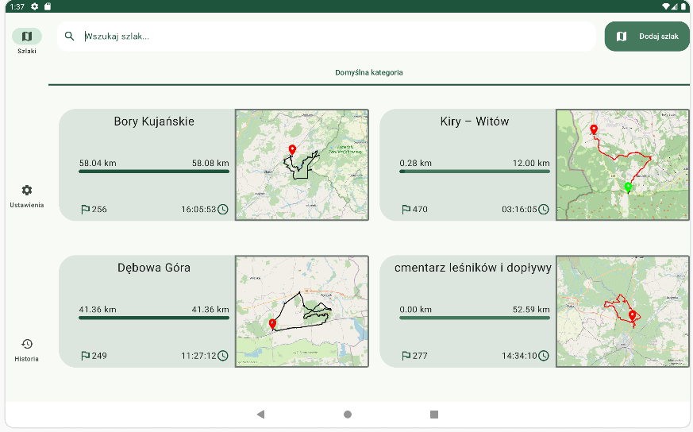
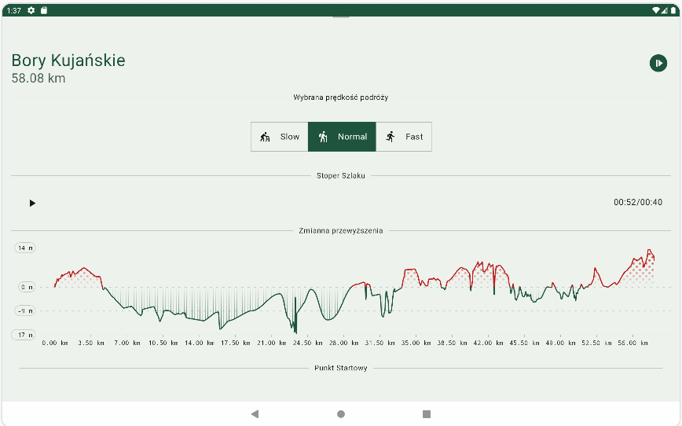
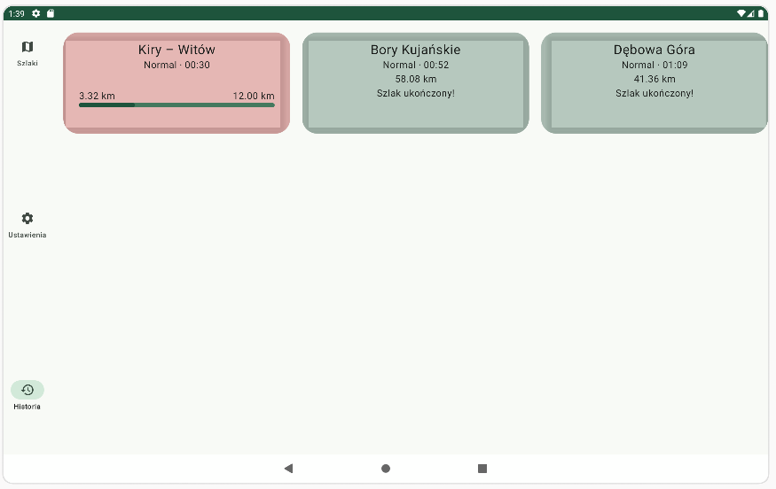

## Wędrownik
#### Aplikacja typu lista-szczegóły z animacją i elementami biblioteki-wsparcia

|                |                |                |
| -------------- | -------------- | -------------- |
|  |  |  |

      

### Streszczenie
Wędrownik jest prostą aplikacją do przeglądania szlaków w formacie gpx oraz xml mającą być wsparciem dla użytkownika w jego hobbistycznych podróżach. 

Aplikacja pozwala na:
* przeglądanie szlaków z widokiem na punkty
* odznaczanie odwiedzonych punktów
* katoryzowanie szlaków według własnych potrzeb,
* wgląd szlaku na interaktywnej mapie
* uruchomienia czasomierza do mierzenia czasu przejścia przez szlak (dla wielu szlaków jednocześnie, przy wyłączonej aplikacji)
* podgląd przewyższenia trasy na animowanym wykresie
* możliwość obliczenia przybliżonego czasu przybycia do następnego punktu
* przeglądanie widoku historii przebytych szlaków wraz ze stanem ich przejścia
* pobieranie lokalizacji geograficznej do pokazania aktualnej pozycji na mapie (z nie wiadomych mi przyczyn, nawet przy wyłączonej aplikacji)
* możliwość zatwierdzenia punktu jako odwiedzony po podejściu do niego wystarczająco blisko*
> (gdzie możliwość to dużo powiedziane, bo z faktycznych 10 prób podejścia pod taki punkt tylko 1 zakończyła się sukcesem [znaczy, że aplikacja załapała podejście pod punkt - a nie że osoba testująca nie doszedła do punktu], dlatego ten punkt i wszystkie związane z użyciem GPS nie będą opisywane szczegółowo i nie są załączone w tym inkremencie)

### Spis treści
1. Specyfikacje aplikacji i wymagania dotyczące uruchomienia
2. Zależności zewnętrzne i użyte biblioteki
3. Zastosowane rozwiązania w kodzie

> Więszke funkcjonalności w tym sprawozdaniu posiadają odnośnik w kwadratowych nawiasach [01:11] do poszczególnego momentu w filmie, w którym pokazywana jest ów funkcjonalność, w nawiasach {} przekazany jest link do miejsca w kodzie repozytorium. Jedyny kod zawarty w sprawozdaniu to opisowy pseudokod.

### 1. Specyfikacje aplikacji i wymagania dotyczące uruchomienia
Do poprawnego uruchomienia aplikacji na urządzeniu mobilnym wymagana jest co najmniej wersja api 30 (android 11), wcześniejsze wersje nie są wspierane. Do kompilacji programu wystarczy najnowsza wersja kotlina, java 17 i agp - który sam pobierze pozostałe pakiety i zbuduje cały projekt, albo działające ide takie jak android studio.

### 2. Zależności zewnętrzne i użyte biblioteki
* Aplikacja napisana w kotline 
* Używa jetpack compose jako frameworku UI

* Hilt + Dagger - umożliwia di(dependency injection) i wprowadza wsparcie dla architektury MVVM
* Room - zarządza bazą danych w orm
* Voyager - lepsze zarządzanie nawigacji i przechowywaniem stanu aplikacji
* OsmDroid - interaktywne mapy (w javie, bez wsparcia i po wstecznej kompatybilności)
* Vico - przedstawienie interaktywnych wykresów

### 3. Zastosowane rozwiązania w kodzie

Aplikacja składa się z kilku aktywności: z podziałem na mniejsze - widoczne tylko przez sekundy - jak początkowy ekran ładowania "LoadingScreen", który swoją animacją ukrywa proces wczytywania danych z bazy danych na telefonie. Pozostałe aktywności odnoszą się do poszczególncych tabów
* [SzlakListScreen]() - przedstawiający bibliotekę szlaków
* SettingsScreen - ekran ustawień
* HistoryScreen - historę
* SzlakListItemScreen - ekran przeglądania pojedynczego szlaku. 